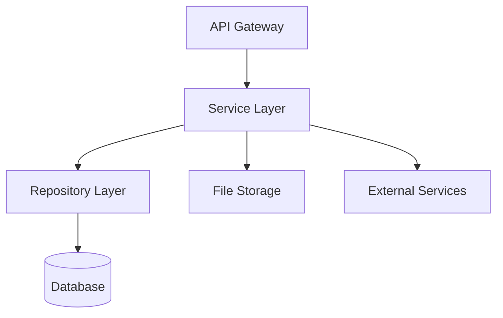

# Phase 6: Documentation & Handoff

You are creating comprehensive documentation for the migrated system.

## Objectives

1. Create migration documentation
2. Create technical specifications
3. Create developer guides
4. Create operational runbooks
5. Prepare handoff materials

## Step 6.1: Migration Overview Documentation

### Create migration-overview.md

```markdown
# COBOL to Cloud Migration - Overview

## Executive Summary

This document provides an overview of the migration from mainframe COBOL to [Java/Node.js] cloud-based applications.

### Migration Scope
- **Programs Migrated**: [X] COBOL programs
- **Lines of Code**: [X] COBOL LOC → [Y] Java/TypeScript LOC
- **Duration**: [Start Date] to [End Date]
- **Team Size**: [X] developers

### Business Impact
- Modernized legacy system
- Improved maintainability
- Cloud-ready architecture
- Enhanced scalability
- Reduced operational costs

## Architecture Overview

### Before Migration
```
[Mainframe Architecture Diagram]
- COBOL Programs
- VSAM Files
- DB2 Database
- CICS Transaction Manager
- JCL Batch Jobs
```

### After Migration
```
[Cloud Architecture Diagram]
- Java/Node.js Services
- Cloud Storage / Database
- REST APIs
- Container Orchestration
- CI/CD Pipeline
```

## Technology Stack

### Target Platform: Java
- **Language**: Java 17
- **Framework**: Spring Boot 3.x
- **Database**: PostgreSQL / Oracle
- **Build Tool**: Maven / Gradle
- **Testing**: JUnit 5, Mockito
- **Deployment**: Docker, Kubernetes

### Target Platform: Node.js
- **Language**: TypeScript 5.x
- **Runtime**: Node.js 18 LTS
- **Framework**: Express.js
- **Database**: PostgreSQL / MongoDB
- **Build Tool**: npm / yarn
- **Testing**: Jest
- **Deployment**: Docker, Kubernetes

## Migration Approach

### Methodology
1. **Analysis Phase**: Analyzed COBOL codebase and dependencies
2. **Design Phase**: Designed target architecture and data models
3. **Implementation Phase**: Converted programs incrementally
4. **Testing Phase**: Validated with comparison testing
5. **Deployment Phase**: Deployed to cloud environment

### Key Decisions

#### Data Type Mapping
- COBOL PIC 9 → BigDecimal (Java) / Decimal (Node.js)
- COBOL PIC X → String
- COBOL COMP-3 → BigDecimal with custom conversion
- COBOL dates → java.time.LocalDate / Date

#### File Handling
- Sequential files → File I/O with fixed-length record parsing
- VSAM files → Relational database tables
- Copybooks → Java classes / TypeScript interfaces

#### Business Logic
- Preserved COBOL arithmetic precision
- Maintained validation rules
- Replicated error handling
- Documented all assumptions

## Program Mapping

| COBOL Program | Migrated Component | Status | Notes |
|---------------|-------------------|--------|-------|
| CUSTMAINT.cbl | CustomerService.java | Complete | Main customer maintenance |
| ACCTPROC.cbl | AccountService.java | Complete | Account processing |
| RPTGEN.cbl | ReportService.java | Complete | Report generation |
| ... | ... | ... | ... |

## Data Migration

### Database Schema
- [X] tables created
- [X] indexes defined
- [X] constraints implemented
- Data migration scripts created

### File Conversion
- Sequential files converted to database tables
- VSAM files migrated to relational schema
- File layouts preserved in documentation

## Testing Summary

### Test Coverage
- Unit Tests: [X]% coverage
- Integration Tests: [X] test cases
- Comparison Tests: [X] programs validated
- Performance Tests: Meets requirements

### Validation Results
- Output comparison: [X]% match rate
- Numeric precision: Validated
- Business logic: Verified
- Edge cases: Tested

## Risks and Mitigation

| Risk | Impact | Mitigation | Status |
|------|--------|------------|--------|
| Precision loss in calculations | High | Use BigDecimal/Decimal | Mitigated |
| Performance degradation | Medium | Optimization and caching | Mitigated |
| Data migration errors | High | Extensive validation | Mitigated |

## Next Steps

1. Production deployment planning
2. User acceptance testing
3. Training for operations team
4. Monitoring setup
5. Gradual rollout strategy

## Appendices

- Appendix A: Detailed program mapping
- Appendix B: Data structure mapping
- Appendix C: Test results
- Appendix D: Performance benchmarks
```

## Step 6.2: Technical Specification

### Create technical-specification.md

```markdown
# Technical Specification

## System Architecture

### High-Level Architecture
[Include architecture diagrams using Mermaid]



### Component Diagram
[Detailed component relationships]

### Data Flow Diagrams
[Show data flow through the system]

## API Documentation

### REST Endpoints

#### Customer Service

**GET /api/customers/{id}**
- Description: Retrieve customer by ID
- Parameters:
  - id (path): Customer ID
- Response: Customer object
- Status Codes: 200, 404, 500

**POST /api/customers**
- Description: Create new customer
- Request Body: Customer object
- Response: Created customer with ID
- Status Codes: 201, 400, 500

[Continue for all endpoints]

## Database Schema

### Tables

#### customers
```sql
CREATE TABLE customers (
    id BIGSERIAL PRIMARY KEY,
    customer_id VARCHAR(10) UNIQUE NOT NULL,
    customer_name VARCHAR(50) NOT NULL,
    balance DECIMAL(11,2) NOT NULL,
    account_status CHAR(1) NOT NULL,
    last_updated TIMESTAMP NOT NULL,
    created_at TIMESTAMP DEFAULT CURRENT_TIMESTAMP,
    updated_at TIMESTAMP DEFAULT CURRENT_TIMESTAMP
);

CREATE INDEX idx_customer_id ON customers(customer_id);
CREATE INDEX idx_account_status ON customers(account_status);
```

[Continue for all tables]

### Entity Relationships
[ER diagram]

## Data Models

### Java Classes

```java
@Entity
@Table(name = "customers")
public class Customer {
    @Id
    @GeneratedValue(strategy = GenerationType.IDENTITY)
    private Long id;
    
    @Column(name = "customer_id", unique = true, nullable = false)
    private String customerId;
    
    // ... other fields
}
```

### TypeScript Interfaces

```typescript
export interface Customer {
    id: number;
    customerId: string;
    customerName: string;
    balance: Decimal;
    accountStatus: string;
    lastUpdated: Date;
}
```

## Configuration

### Application Configuration

#### Java (application.yml)
```yaml
spring:
  datasource:
    url: jdbc:postgresql://localhost:5432/migration_db
    username: ${DB_USERNAME}
    password: ${DB_PASSWORD}
  jpa:
    hibernate:
      ddl-auto: validate
    show-sql: false
```

#### Node.js (.env)
```
DATABASE_URL=postgresql://localhost:5432/migration_db
NODE_ENV=production
LOG_LEVEL=info
```

## Security

### Authentication
- JWT-based authentication
- Token expiration: 1 hour
- Refresh token: 7 days

### Authorization
- Role-based access control (RBAC)
- Roles: ADMIN, USER, READONLY

### Data Protection
- Encryption at rest
- TLS for data in transit
- PII data masking in logs

## Performance Considerations

### Optimization Strategies
- Database connection pooling
- Query optimization with indexes
- Caching frequently accessed data
- Async processing for long-running tasks

### Scalability
- Horizontal scaling with load balancer
- Stateless service design
- Database read replicas

## Error Handling

### Error Codes
- 1000-1999: Validation errors
- 2000-2999: Business logic errors
- 3000-3999: Data access errors
- 4000-4999: External service errors
- 5000-5999: System errors

### Error Response Format
```json
{
    "error": {
        "code": 1001,
        "message": "Invalid customer ID format",
        "details": "Customer ID must be 10 characters",
        "timestamp": "2026-02-18T10:30:00Z"
    }
}
```
```

## Step 6.3: Developer Guide

### Create developer-guide.md

```markdown
# Developer Guide

## Getting Started

### Prerequisites
- Java 17+ / Node.js 18+
- Maven 3.8+ / npm 8+
- PostgreSQL 15+
- Docker (optional)
- Git

### Setup Instructions

#### Clone Repository
```bash
git clone https://github.com/org/cobol-migration.git
cd cobol-migration
```

#### Java Setup
```bash
# Install dependencies
mvn clean install

# Run tests
mvn test

# Run application
mvn spring-boot:run
```

#### Node.js Setup
```bash
# Install dependencies
npm install

# Run tests
npm test

# Run application
npm run dev
```

### Database Setup
```bash
# Create database
createdb migration_db

# Run migrations
mvn flyway:migrate  # Java
npm run migrate     # Node.js
```

## Project Structure

### Java Project
```
src/
├── main/
│   ├── java/com/migration/cobol/
│   │   ├── model/          # Data models
│   │   ├── service/        # Business logic
│   │   ├── repository/     # Data access
│   │   ├── controller/     # REST controllers
│   │   ├── util/           # Utilities
│   │   └── legacy/         # COBOL compatibility
│   └── resources/
│       ├── application.yml
│       └── db/migration/   # Flyway scripts
└── test/
    └── java/               # Tests
```

### Node.js Project
```
src/
├── models/         # TypeScript types
├── services/       # Business logic
├── repositories/   # Data access
├── controllers/    # Route handlers
├── utils/          # Utilities
├── legacy/         # COBOL compatibility
└── index.ts        # Entry point
```

## Coding Standards

### Java
- Follow Google Java Style Guide
- Use Lombok to reduce boilerplate
- Write JavaDoc for public APIs
- Maintain > 80% test coverage

### TypeScript
- Follow Airbnb TypeScript Style Guide
- Use strict mode
- Write JSDoc for exported functions
- Maintain > 80% test coverage

## Common Development Tasks

### Adding a New Service

#### Java
```java
@Service
public class NewService {
    private final NewRepository repository;
    
    public NewService(NewRepository repository) {
        this.repository = repository;
    }
    
    public Result processData(Input input) {
        // Implementation
    }
}
```

#### TypeScript
```typescript
export class NewService {
    constructor(private repository: NewRepository) {}
    
    async processData(input: Input): Promise<Result> {
        // Implementation
    }
}
```

### Adding Database Migration

#### Java (Flyway)
Create `src/main/resources/db/migration/V3__add_new_table.sql`

#### Node.js (TypeORM)
```bash
npm run migration:generate -- -n AddNewTable
```

### Running Tests
```bash
# Java
mvn test                    # All tests
mvn test -Dtest=ClassName   # Specific test

# Node.js
npm test                    # All tests
npm test -- NewService      # Specific test
```

## Debugging

### Java
- Use IDE debugger (IntelliJ IDEA, Eclipse)
- Remote debugging: `-agentlib:jdwp=transport=dt_socket,server=y,suspend=n,address=5005`

### Node.js
- Use VS Code debugger
- Chrome DevTools: `node --inspect`

## COBOL Migration Patterns

### Converting COBOL Programs
1. Analyze COBOL program structure
2. Map data structures to Java/TypeScript
3. Convert business logic preserving behavior
4. Create comparison tests
5. Validate output matches COBOL

### Using Compatibility Layer
```java
// Java
BigDecimal value = CobolDataTypes.unpackComp3(bytes, 2);
String padded = CobolDataTypes.padRight(str, 50);
```

```typescript
// TypeScript
const value = CobolDataTypes.unpackComp3(buffer, 2);
const padded = CobolDataTypes.padRight(str, 50);
```

## Troubleshooting

### Common Issues

**Issue**: Numeric precision mismatch
**Solution**: Use BigDecimal (Java) or Decimal.js (Node.js)

**Issue**: Date format errors
**Solution**: Use CobolDataTypes date conversion utilities

**Issue**: File encoding problems
**Solution**: Check for EBCDIC encoding, use conversion utilities

## Resources

- [COBOL Migration SOP](.kiro/steering/)
- [API Documentation](./api-docs.md)
- [Database Schema](./schema.md)
- [Team Wiki](https://wiki.company.com/migration)
```

## Step 6.4: Operations Runbook

### Create operations-runbook.md

```markdown
# Operations Runbook

## Daily Operations

### System Health Checks

#### Check Application Status
```bash
# Java
curl http://localhost:8080/actuator/health

# Node.js
curl http://localhost:3000/health
```

Expected response: `{"status": "UP"}`

#### Check Database Connectivity
```bash
psql -h localhost -U dbuser -d migration_db -c "SELECT 1;"
```

#### Check Logs
```bash
# Java
tail -f logs/application.log

# Node.js
tail -f logs/app.log
```

### Monitoring

#### Key Metrics
- Response time: < 200ms (p95)
- Error rate: < 1%
- CPU usage: < 70%
- Memory usage: < 80%
- Database connections: < 80% of pool

#### Monitoring Tools
- Application: Prometheus + Grafana
- Logs: ELK Stack (Elasticsearch, Logstash, Kibana)
- APM: New Relic / Datadog

### Backup Procedures

#### Database Backup
```bash
# Daily backup
pg_dump -h localhost -U dbuser migration_db > backup_$(date +%Y%m%d).sql

# Verify backup
pg_restore --list backup_$(date +%Y%m%d).sql
```

#### Application Backup
- Code: Git repository
- Configuration: Version controlled
- Data files: Cloud storage with versioning

## Incident Response

### Severity Levels

**P1 - Critical**: System down, data loss
- Response time: Immediate
- Escalation: On-call engineer + manager

**P2 - High**: Major functionality impaired
- Response time: 30 minutes
- Escalation: On-call engineer

**P3 - Medium**: Minor functionality impaired
- Response time: 4 hours
- Escalation: Next business day

**P4 - Low**: Cosmetic issues
- Response time: Next sprint
- Escalation: None

### Common Issues and Solutions

#### Issue: Application Not Responding

**Symptoms**: HTTP 503 errors, timeouts

**Diagnosis**:
```bash
# Check if process is running
ps aux | grep java  # or node

# Check resource usage
top -p <PID>

# Check logs
tail -100 logs/application.log
```

**Resolution**:
1. Check for memory leaks or CPU spikes
2. Restart application if necessary
3. Check database connectivity
4. Review recent deployments

#### Issue: Database Connection Pool Exhausted

**Symptoms**: "Connection pool exhausted" errors

**Diagnosis**:
```sql
SELECT count(*) FROM pg_stat_activity WHERE datname = 'migration_db';
```

**Resolution**:
1. Identify long-running queries
2. Kill problematic connections if needed
3. Increase pool size if consistently high
4. Review application for connection leaks

#### Issue: High Memory Usage

**Symptoms**: OutOfMemoryError, slow performance

**Diagnosis**:
```bash
# Java heap dump
jmap -dump:live,format=b,file=heap.bin <PID>

# Node.js heap snapshot
node --inspect app.js
# Use Chrome DevTools to capture heap snapshot
```

**Resolution**:
1. Analyze heap dump for memory leaks
2. Increase heap size if needed
3. Review code for large object retention
4. Implement pagination for large datasets

### Rollback Procedures

#### Application Rollback
```bash
# Kubernetes
kubectl rollout undo deployment/migration-app

# Docker
docker stop migration-app
docker run -d --name migration-app previous-image:tag
```

#### Database Rollback
```bash
# Flyway (Java)
mvn flyway:undo

# TypeORM (Node.js)
npm run migration:revert
```

## Maintenance Tasks

### Weekly Tasks
- [ ] Review error logs
- [ ] Check disk space
- [ ] Verify backups
- [ ] Review performance metrics
- [ ] Update dependencies (security patches)

### Monthly Tasks
- [ ] Database maintenance (VACUUM, ANALYZE)
- [ ] Review and archive old logs
- [ ] Capacity planning review
- [ ] Security audit
- [ ] Disaster recovery drill

### Quarterly Tasks
- [ ] Full system audit
- [ ] Performance tuning
- [ ] Update documentation
- [ ] Review and update runbook

## Deployment Procedures

### Pre-Deployment Checklist
- [ ] Code reviewed and approved
- [ ] All tests passing
- [ ] Database migrations tested
- [ ] Rollback plan prepared
- [ ] Stakeholders notified
- [ ] Maintenance window scheduled

### Deployment Steps

#### Java Application
```bash
# Build
mvn clean package

# Stop application
systemctl stop migration-app

# Deploy new version
cp target/migration-app.jar /opt/migration/

# Start application
systemctl start migration-app

# Verify
curl http://localhost:8080/actuator/health
```

#### Node.js Application
```bash
# Build
npm run build

# Stop application
pm2 stop migration-app

# Deploy new version
cp -r dist/* /opt/migration/

# Start application
pm2 start migration-app

# Verify
curl http://localhost:3000/health
```

### Post-Deployment Verification
- [ ] Application started successfully
- [ ] Health check passing
- [ ] No errors in logs
- [ ] Key functionality tested
- [ ] Monitoring alerts normal

## Emergency Contacts

| Role | Name | Phone | Email |
|------|------|-------|-------|
| On-Call Engineer | [Name] | [Phone] | [Email] |
| Database Admin | [Name] | [Phone] | [Email] |
| Team Lead | [Name] | [Phone] | [Email] |
| Manager | [Name] | [Phone] | [Email] |

## Escalation Path

1. On-Call Engineer (immediate)
2. Team Lead (if not resolved in 30 min)
3. Manager (if P1 or not resolved in 2 hours)
4. Director (if P1 and not resolved in 4 hours)
```

## Validation Checklist

Before completing Phase 6:
- [ ] Migration overview document created
- [ ] Technical specification complete
- [ ] Developer guide written
- [ ] Operations runbook created
- [ ] All diagrams included
- [ ] API documentation complete
- [ ] Database schema documented
- [ ] Troubleshooting guides included
- [ ] Contact information updated
- [ ] All documents reviewed

## Migration Complete!

All phases of the COBOL to Cloud migration are now complete. The system is documented, tested, and ready for production deployment.
